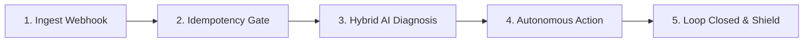

# 🚀 Razorpay RecoverIQ — Complete User & Interaction Guide

Welcome to **RecoverIQ**, an autonomous revenue recovery engine built for Razorpay merchants. This guide explains how to interact with the dashboard, test AI-powered recovery workflows, and integrate with live payment webhooks.

---

## 📑 Table of Contents
1. [Overview & Value Proposition](#overview--value-proposition)
2. [Quick Start Links & Commands](#quick-start-links--commands)
3. [Step-by-Step User Interaction Flow](#step-by-step-user-interaction-flow)
4. [Interactive Features Deep Dive](#interactive-features-deep-dive)
   - [Interactive Playground (Inject Single Failure)](#1-interactive-playground-inject-single-failure)
   - [50-Event Batch Simulation](#2-50-event-batch-simulation)
   - [Transaction Inspector Drawer](#3-transaction-inspector-drawer)
   - [Autonomous Audit Log](#4-autonomous-audit-log)
   - [5-Stage Architecture Deep Dive](#5-5-stage-architecture-deep-dive)
5. [The 5-Stage Autonomous Pipeline](#the-5-stage-autonomous-pipeline)
6. [API Endpoints Reference](#api-endpoints-reference)
7. [Environment & Configuration](#environment--configuration)

---

## 💡 Overview & Value Proposition

When transactions fail on Razorpay (due to bank switch outages, insufficient balance, OTP drop-offs, or blocked cards), merchants lose customers and revenue. 

**RecoverIQ solves this autonomously:**
- **Zero-Latency Ingestion**: Processes `payment.failed` webhooks in real time.
- **Smart Classification**: Uses **Google Gemini AI** backed by a **1.5s Circuit Breaker** to diagnose failure reasons.
- **Tailored Customer Recovery**: Generates 1-click Razorpay recovery links and sends personalized Hinglish/English recovery nudges via WhatsApp or Email.
- **Smart Downtime Handling**: Automatically schedules **Silent Retries** during bank switch outages without spamming customers.
- **Anti-Spam Guardrails**: Hard limit of 3 contact attempts per order to protect customer trust.
- **Automatic Closure**: Listens for `payment.captured` webhooks to instantly transition orders to `RECOVERED`.

---

## 🔗 Quick Start Links & Commands

| Service | Localhost Link | Description |
| :--- | :--- | :--- |
| **Frontend Dashboard** | [http://localhost:3000](http://localhost:3000) | React + Tailwind interactive dashboard |
| **Backend API Docs** | [http://localhost:8000/docs](http://localhost:8000/docs) | Interactive Swagger UI |
| **Metrics Endpoint** | [http://localhost:8000/api/stats](http://localhost:8000/api/stats) | JSON feed for KPIs, transactions & logs |

### Starting the Servers Manually
```bash
# Terminal 1 — Backend
.\venv\Scripts\python.exe app.py

# Terminal 2 — Frontend
npm run dev
```

---

## 🧭 Step-by-Step User Interaction Flow

### 1️⃣ Step 1: Open the Dashboard
Navigate to [http://localhost:3000](http://localhost:3000). Verify that the top-right indicator displays **🟢 LIVE CONNECTED**.

### 2️⃣ Step 2: Inject a Single Failure via Playground
1. Click the **`Open Playground`** (or **`Inject Failure`**) button in the top navigation bar.
2. Select one of the 4 failure scenarios:
   - **Insufficient Funds**: Low balance in customer account/UPI.
   - **Bank Downtime**: HDFC/NPCI gateway timeout.
   - **User Abandonment**: User closed the app or abandoned the OTP step.
   - **Card Blocked**: Card security decline by issuing bank.
3. Enter an order amount (e.g., `₹2,499`) and customer name (e.g., `Ankit Verma`).
4. Click **`⚡ Ingest Webhook & Trigger AI Engine`**.
5. **Observe the result:**
   - The AI engine analyzes the failure in milliseconds.
   - A real **Razorpay Payment Link** is generated.
   - The transaction appears in the live table with its diagnostic tag and recovery channel.

### 3️⃣ Step 3: Run the 50-Event Batch Simulation
1. Click the **`⚡ Run 50-Event Batch`** button in the header.
2. The backend executes `simulate_batch.py`, simulating a busy merchant receiving 50 diverse failed transactions.
3. Watch the dashboard dynamically update:
   - **Revenue at Risk** vs. **Revenue Recovered** counters increment.
   - **Recovery Rate %** recalculates automatically.
   - Real-time events stream into the **Recent Failure Events** table and **Audit Log**.

### 4️⃣ Step 4: Inspect Transaction Details
1. In the **Recent Failure Events** table, filter transactions by state (`ALL`, `RECOVERED`, `NUDGED_WHATSAPP`, `SILENT_RETRY`, `TERMINATED`).
2. Use the search bar to find a specific customer or Order ID.
3. **Click on any transaction row** to open the side inspector drawer:
   - **Diagnostic Insight**: AI rationale and root-cause classification.
   - **Channel Dispatch**: Tailored WhatsApp/Email message copy.
   - **1-Click Payment Link**: Clickable link to test the checkout experience.
   - **State Progression**: Timeline from failure to recovery.

### 5️⃣ Step 5: Audit System Decisions
Review the **Autonomous Audit Log** panel on the right:
- Track immutable state transitions: `PENDING` ➔ `NUDGED_WHATSAPP` ➔ `RECOVERED`.
- Identify whether a decision was made by **Gemini AI** (`AI Decision`) or the **Deterministic Circuit Breaker** (`Rule Engine`).

---

## 🛠️ Interactive Features Deep Dive

### 1. Interactive Playground (Inject Single Failure)
Enables QA engineers and merchants to simulate any custom failure webhook on demand without needing an external webhook generator.

### 2. 50-Event Batch Simulation
Tests system resilience under load, validating:
- **Idempotency**: Prevents double-processing if webhooks are received twice.
- **Circuit Breaker**: Handles API rate limits seamlessly.
- **Guardrails**: Terminates retry loops once 3 attempts are reached.

### 3. Razorpay 1-Click Recovery Checkout Modal
Clicking **"Pay Link"** in the transaction ledger, **"⚡ 1-Click Pay Now"** in the inspector drawer, or **"⚡ 1-Click Test Checkout"** in the playground opens an interactive checkout modal supporting **UPI QR/Apps (GPay, PhonePe, Paytm)**, **Cards**, and **NetBanking**. Completing payment immediately dispatches a `payment.captured` event to resolve the transaction.

### 4. Transaction Inspector Drawer
Clicking any transaction displays:
- Customer contact info (Name, Email, Phone).
- Failure code & normalized message.
- Recovery strategy with confidence score.
- Live WhatsApp / Email customer communication preview.
- Generated Razorpay payment link URL and 1-click payment trigger.

### 5. Autonomous Audit Log & Live AI Decision Stream
Provides end-to-end auditability and compliance for financial transactions, recording every state change, timestamp, and whether Gemini AI or the circuit breaker executed the decision.

### 6. AI Assistant Chatbot
Floating bottom-right assistant powered by Gemini 2.5 Flash (`POST /api/chat`) to answer merchant questions on architecture, retry logic, and compliance.

### 7. Reset to Zero State
Clicking **"Reset Data"** in the top navigation bar executes `POST /api/reset` to clear all transactions, idempotency locks, and audit logs, returning the dashboard to a clean zero state.

---

## ⚙️ The 5-Stage Autonomous Pipeline



1. **Ingest Webhook**: Normalizes payloads from Razorpay's `payment.failed` event into a unified data structure.
2. **Idempotency Gate**: Deduplicates events using unique SHA-256 event hashes and enforces the 3x anti-spam retry limit.
3. **Hybrid AI Diagnosis**: Calls Google Gemini 2.5 Flash with a 1.5s circuit breaker fallback to classify failures (User Drop-off, Bank Outage, Low Balance, or Blocked Card).
4. **Autonomous Action**:
   - *Bank Outage*: Dispatches `SILENT_RETRY` (no customer disturbance).
   - *User Drop-off / Low Funds*: Generates Razorpay 1-click payment link and sends WhatsApp/Email nudge.
5. **Loop Closed & Shield**: When the customer pays, `payment.captured` transitions the order to `RECOVERED` and closes the recovery loop.

---

## 📡 API Endpoints Reference

| Method | Endpoint | Description |
| :--- | :--- | :--- |
| `GET` | `/api/stats` | Fetches dashboard KPI metrics, recent transactions, and audit logs. |
| `POST` | `/webhook/razorpay` | Ingests Razorpay webhook payloads (`payment.failed` / `payment.captured`). |
| `POST` | `/api/simulate-batch` | Asynchronously triggers the 50-event simulation script. |
| `POST` | `/api/chat` | AI chatbot assistant proxy endpoint (Gemini 2.5 Flash). |
| `POST` | `/api/reset` | Resets SQLite database tables back to clean zero state. |
| `GET` | `/docs` | Interactive Swagger API documentation. |
| `GET` | `/redoc` | OpenAPI specification documentation. |

---

## 🔐 Environment & Configuration

Configure your API keys in `.env`:
```env
# Razorpay API Credentials (Test Mode)
RAZORPAY_KEY_ID=rzp_test_your_key_id
RAZORPAY_KEY_SECRET=your_key_secret

# Google Gemini API Key (for intelligent classification)
GEMINI_API_KEY=your_gemini_api_key_here
```
*(Note: If API keys are not provided, RecoverIQ automatically falls back to deterministic rule-based recovery and mock payment links.)*
